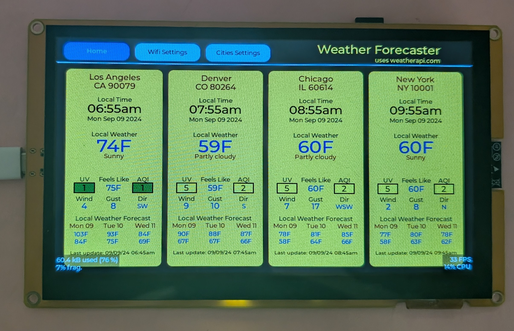

# Rust ESP32S3 Lvgl - Weather Forecaster App
This application shows how to use lv-binding-rust crate on a ESP32S3 device along with the touchscreen.  The program will display weather and time information for 4 cities.


## Development Board
Aliexpress ESP32-8048S070 - 7 inch 800x400 TN RGB with ESP32S3, 8M PSRAM, 16M Flash, 512KB SRAM

## SDcard
I used a class 10, 4GB SDcard for storage.

## Overview
The Weather Forecaster App shows current time and date, current weather conditions and forecasted weather for 4 cities in the Home pane.  Any or all of the four cities can be changed by going to the Cities Settings and clicking the Edit button.  The App uses the zipcode to download weather data from weatherapi.com every 10 minutes.  The user must register with weatherapi.com to get a key to allow downloading the weather data.

The Wifi Settings pane allows the user to change the wifi network (SSID) and the wifi password after clicking the Edit button.

The Wifi settings, the four Cities settings and the Weather API key are each stored in seperate text files on the SDCard.  Wifi settings are stored in WIFI.TXT file, the Cities settings are stored in CITIES.TXT file and the Weather API key is stored in KEY.TXT file.  These file need to be the correct information before starting the APP as the APP reads the SDCard at startup to to obtain the information for the APP.

If the user changes a Wifi Setting or a Cities Setting the changes will be saved to the SDCard so when the device is powered down and then powered up it will show the latest changes.

## partition-table folder
The partition-table folder contains a file called partitons.csv.  This file increases the default factory/app partiton from the default of 1M to 3M. This allows us more space for our program and since the flash size is 16M this should not be a problem.  This file will be called when we flash the device.

## custom-fonts folder
I left the custom-fonts folder in the project but currenly I am not using a custom but but instead using various LV_FONT_MONTSERRAT_xx enabled in the lv_conf.h file.
The custom-fonts folder contains our custom fonts.  The customs fonts are converted from TTF fonts using lvgl online font converter at https://lvgl.io/tools/fontconverter.  I used https://ttfonts.net to find a font I liked and then downloaded the font.  In the lvgl-online-font-converter I used the font name plus the font size for the name of the font.  I chose Bpp of 2 bit-per-pixel and set the range of 0x30-0x3A since I only need numbers and the ":" character.  After clicking on "Convert" the file will be downloaded. I placed this downloaded file (*.c) into the custom-fonts folder.  Then I created a header file which has an extern to my *.c file, along with changing the ifndef and define names.
To use this custom font, I added ```LVGL_FONTS_DIR = {relative = true, value = "custom-fonts"}``` to my config.toml under [env].  This allows our font to be compiled when lvgl is compiled.

## lvgl-configs folder
The lvgl-configs folder holds the lv_config.h and lv_drv_conf.h files which are required by lvgl to compile.  Everything in lv_drv_conf.h file is set to 0 as I am not using the lvgl drivers.  The following changes were made to the lv_conf.h file.
1. Enabled LV_FONT_MONTSERRAT_10, LV_FONT_MONTSERRAT_12, LV_FONT_MONTSERRAT_14, LV_FONT_MONTSERRAT_16, LV_FONT_MONTSERRAT_24, LV_FONT_MONTSERRAT_36 fonts
2. For debugging I enabled LV_USE_PERF_MONITOR 1 and LV_USE_MEM_MONITOR 1, if memory fragmentation was high (greater than 60%) the I would increase LV_MEM_SIZE.  I also looked at the CPU usage percentage, the typical usage was between 4%-16%
3. Changed LV_MEM_SIZE to (80U * 1024U)

## lcd_panel.rs file
The LCD RGB panel driver.

## gt911.rs file
The GT911 touchscreen controller driver.

## sdkconfig.defaults file
Increased the main stack size
```
CONFIG_ESP_MAIN_TASK_STACK_SIZE=16000
```

Set the FreeRTOS kernel tick frequency to 1000 Hz
```
CONFIG_FREERTOS_HZ=1000
```

The added the following to use PSRAM.
```
CONFIG_SPIRAM=y
CONFIG_SPIRAM_MODE_OCT=y
CONFIG_SPIRAM_SPEED_80M=y

# Enabling the following configurations can help increase the PCLK frequency in the case when
# the Frame Buffer is allocated from the PSRAM and fetched by EDMA
CONFIG_SPIRAM_FETCH_INSTRUCTIONS=y
CONFIG_SPIRAM_RODATA=y
```

## Cargo.toml project file
I added the following to the "dependencies" section.
```
log = { version = "0.4", default-features = false }

esp-idf-svc = { version = "0.49.1", default-features = false }

cstr_core = "0.2.1"
embedded-graphics-core = "0.4.0"

lvgl = { version = "0.6.2", default-features = false, features = [
    "embedded_graphics",
    "unsafe_no_autoinit",
    #"lvgl_alloc",
    #"alloc"
] }

lvgl-sys = { version = "0.6.2" }

embedded-hal = { version = "1.0.0" }
embedded-svc = "0.28"

anyhow = "1.0"
serde = { version = "1.0.195", features = ["derive"] }
serde_json = "1.0"

chrono = "0.4.31"
chrono-tz = { version = "0.6.2", features = [ "filter-by-regex" ] }

embedded-sdmmc = "0.7.0"
heapless = "0.8.0"

```

I also included patch.crates-io section to patch lvgl and lvgl-sys
```
[patch.crates-io]
lvgl = { git = "https://github.com/enelson1001/lv_binding_rust"}
lvgl-sys = { git = "https://github.com/enelson1001/lv_binding_rust"}

```

## config.toml
To get lv-bindings-rust to comple and build I made the following changes to the config.toml file.
```
[build]
target = "xtensa-esp32s3-espidf"

[target.xtensa-esp32s3-espidf]
linker = "ldproxy"
# runner = "espflash --monitor" # Select this runner for espflash v1.x.x
runner = "espflash flash --monitor" # Select this runner for espflash v2.x.x
rustflags = [
    # Extending time_t for ESP IDF 5: https://github.com/esp-rs/rust/issues/110
    "--cfg",
    "espidf_time64",
]

[unstable]
build-std = ["std", "panic_abort"]

[env]
MCU="esp32s3"
# Note: this variable is not used by the pio builder (`cargo build --features pio`)
#ESP_IDF_VERSION = "v5.1.2"
ESP_IDF_VERSION = "v5.2.2"

# The directory that has the lvgl config files - lv_conf.h, lv_drv_conf.h
DEP_LV_CONFIG_PATH = { relative = true, value = "lvgl-configs" }

# Required to make lvgl build correctly otherwise get wrong file type (ie compiled for a big endian system and target is little endian)
CROSS_COMPILE = "xtensa-esp32s3-elf"

# Required for lvgl otherwise the build would fail with the error -> dangerous relocation: call8: call target out of range
# for some lvgl functions
CFLAGS_xtensa_esp32s3_espidf="-mlongcalls"

# Directory for custom fonts (written in C) that Lvgl can use
LVGL_FONTS_DIR = {relative = true, value = "custom-fonts"}

# Filter timezones so only US get installed
CHRONO_TZ_TIMEZONE_FILTER="(US/.*)"
```

## lv-binding-rust fork
I updated my fork of lv-binding-rust to include PR153 ie the changes recommended by madwizard-thomas.

## Flashing the ESP32S3 device
I used the following command to flash the ESP32S3 device.
```
$ cargo espflash flash --partition-table=partition-table/partitions.csv --monitor
```
The application used 67.02% of the flash as shown in the bootup message: ```App/part. size:    2,108,176/3,145,728 bytes, 67.02%```

## My observations
1. I use button matrix for the navigation buttons and it is used by the virtual lvgl keyboard.  The virtual keyboard response to a clicked key seems slow and I could not find a way to improve this.
2. The AQI reading from weatherapi.com seems to be inaccurate as compared to AirNow.
3. I believe I am really close to maxing out the available RAM on the ESP32S3.

## The case
I purchased the case from vendor on Etsy - The3dPrintedNerd.  https://www.etsy.com/listing/1498992104/esp-32-7-case-with-stand-perfect-for

I liked that the case can be either wall-mounted or includes bracket to allow it to sit on desk.

## Pictures of Aliexpress ESP32S3 running the app
## Video Weather Forecaster App - development board installed in case.

https://github.com/user-attachments/assets/c3700de9-bfa1-4c5c-8fe7-5f85276c9ba6

## The Home pane


## The Wifi Settings pane


## The Wifi Settings pane with edit button clicked


## The Cities Settings pane


## The Cities Settings pane with edit button clicked


# Versions
### v1.0 :
- initial release
